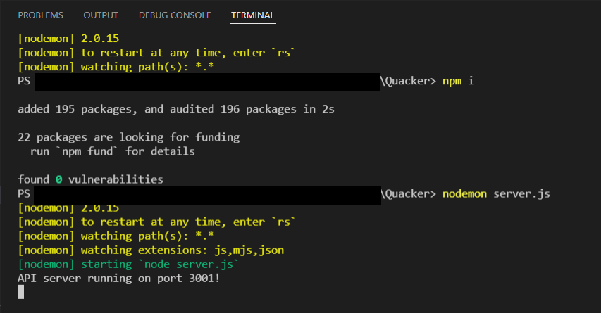
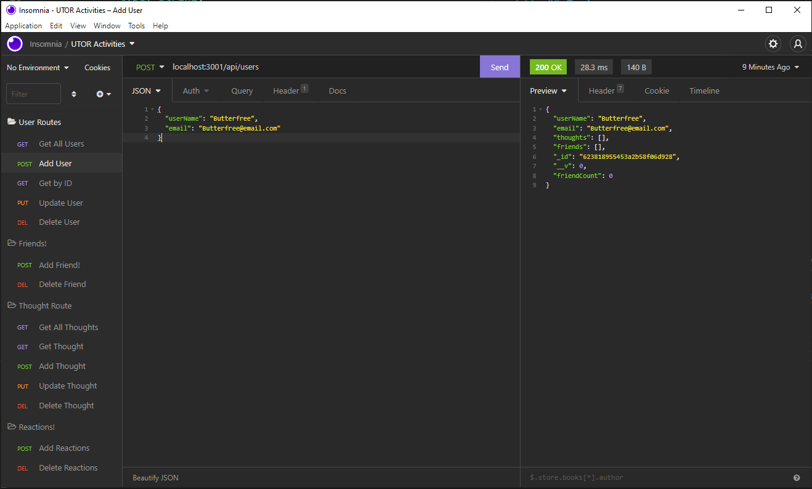

# Quacker: Social Network API

## License
  [](https://opensource.org/licenses/MIT)
  [](https://docs.npmjs.com/policies/npm-license)

## Table of Contents

[Description](#description)

[Installation](#installation)

[Usage](#usage)

[Test](#test)

[Screenshot](#screenshot)

[Demo](#demo)

[Contributors](#contributors)

## Description

This is a back-end application for Quacker, a start-up backend project for Social Media Network. 

This application was made using JavaScript, MongoDB, Mongoose, Node JS, Express.JS API and NPM Packages. 

This application is currently not deployed as it does not have a frontend developed. 

## Installation

  For Installation, you are required the following:
  - Node JS (NPM Packages) 
  - Insomnia (to handle post/put requests for the database)
  
  Additional packages required are: 
  - Node Packet Manager(NPM):
    - NPM [nodemon](https://www.npmjs.com/package/nodemon)
    - NPM [express](https://www.npmjs.com/package/express)
    - NPM [mongoose](https://www.npmjs.com/package/mongoose)
    - NPM [require](https://www.npmjs.com/package/require)
    - NPM [moment](https://www.npmjs.com/package/moment)

  You can install the above required packages by entering following on the terminal/node:
  ```
    npm install   or   npm i 
  ```
## Usage
This application is not deployed currently as it does not have a front end. However, you are still able to use this application by cloning or forking my repository and running the files on your IDE, Terminal, Console, Node or Powershell.

1. In your console, you may run the server.js file to start using your application. 
    ```
    npm start          or        nodemon server.js
    ```

2. Confirm the server as per the log on your console, and use the route to begin manipulating the database! 

    ```
    App listening on port 3001!
    ```

## Test
No testing was done for this project. 

However, please feel free to add the feature to contribute to this project or contact me for more details!

## Screenshot





## Demo 
Demo Video is divided into 2 Parts: 

Demo: Visual Studio Guide [here](https://youtu.be/sCtIlofURWQ)

Demo: Insomnia Guide [here](https://youtu.be/bOc05Kgt0r0)
## Contribution

    Joe Lee 2022

    Got any questions or want to contribute to this project? 

Contact me via: 

  - [Jollypong](https//:github.com/Jollypong) 

  - Email: joeleegc@gmail.com

## 